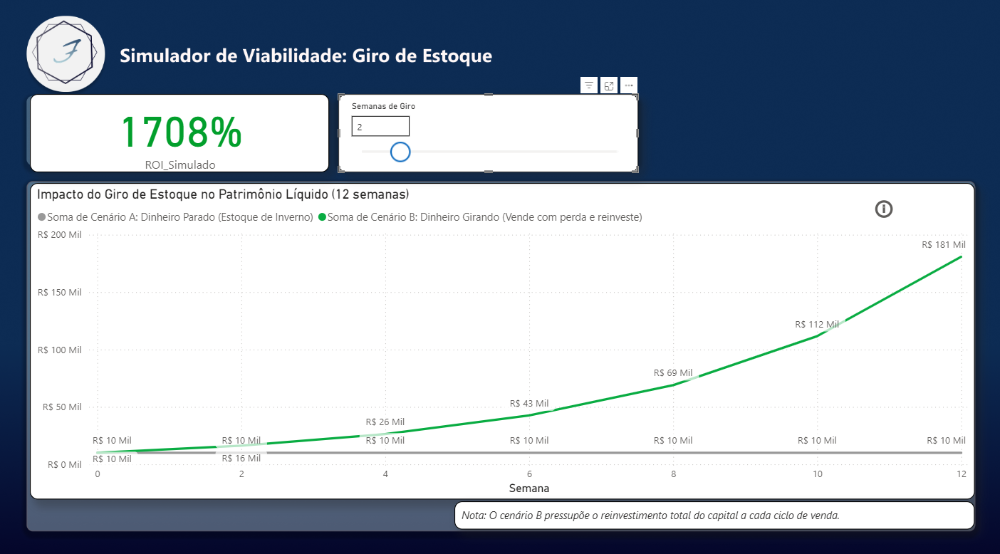
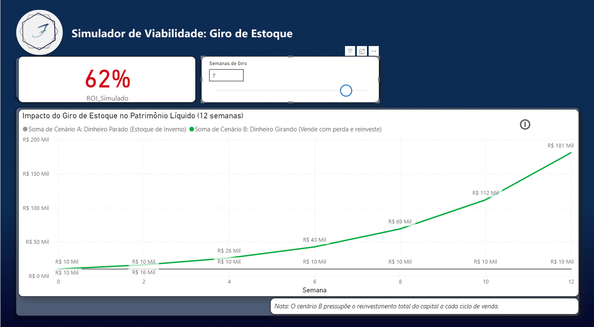

Simulador de ROI e Estratégia de Giro de Estoque

Dashboard interativo em Power BI para otimização de fluxo de caixa e simulação de rentabilidade.

Descrição do Projeto

Análise estratégica desenvolvida para demonstrar o impacto do Giro de Ativos sobre o acúmulo de capital. 
O projeto simula a diferença entre manter estoque estagnado (Cenário A) e adotar uma estratégia de reinvestimento agressivo (Cenário B).

Diferenciais Técnicos

 -> Parâmetros Dinâmicos (What-if): O usuário pode simular em tempo real o tempo de giro do estoque (de 1 a 8 semanas) e ver o impacto imediato no ROI.

 -> DAX Estratégico: Medidas calculadas para juros compostos de reinvestimento e retorno sobre investimento.

 -> UX Design & Alertas: Aplicação de formatação condicional (KPIs que mudam de cor) para sinalizar zonas de risco operacional (Vermelho) ou sucesso (Verde).

Insights de Negócio

O modelo prova que a velocidade do giro é um multiplicador de capital mais potente que a margem unitária. 
Com um giro eficiente, é possível alcançar um ROI superior a 1.700% em 12 semanas, partindo de um capital inicial de R$ 10.000,00.

