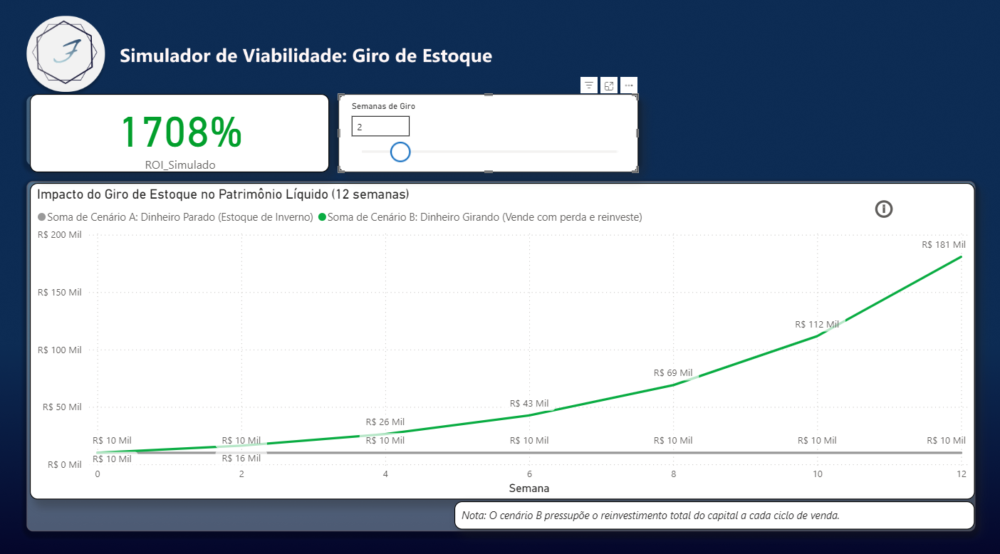
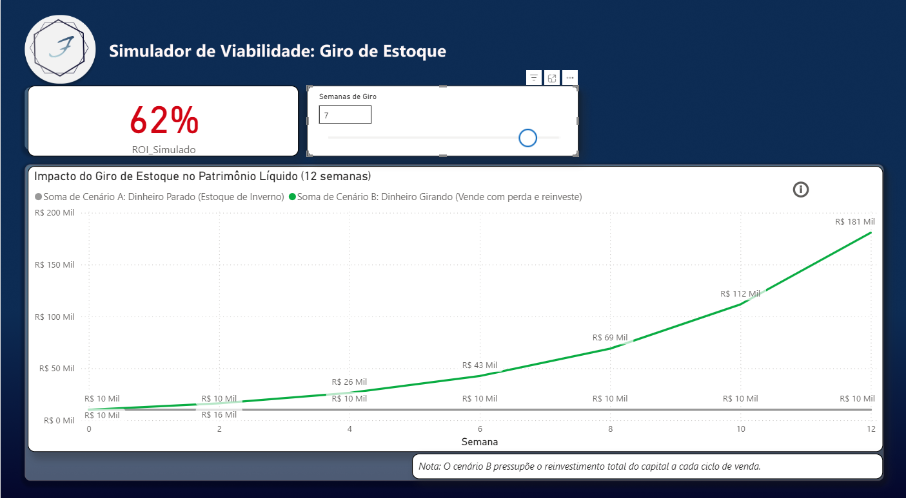

# Simulador de ROI e Estratégia de Giro de Estoque

Solução analítica e interativa em Power BI desenvolvida para otimizar o fluxo de caixa no varejo. O projeto funciona como um motor de simulação financeira, permitindo avaliar matematicamente o impacto da velocidade do giro de estoque sobre o acúmulo de capital e a rentabilidade do negócio.

*Figura 1: Cenário otimizado demonstrando o poder do reinvestimento com giro rápido.*

## O Problema de Negócio
No varejo, estoque parado é custo de oportunidade. O dilema clássico dos gestores é: "Vale a pena manter o estoque estagnado aguardando a venda pelo preço cheio (Cenário A), ou é mais lucrativo liquidar rapidamente (mesmo com perda de margem inicial) para reinvestir o capital de forma agressiva em novos ciclos (Cenário B)?"

## A Solução (Dashboard)
Este painel simula a viabilidade financeira de ambas as estratégias ao longo de 12 semanas. Através de parâmetros de simulação ("What-If"), o gestor pode alterar o tempo médio de giro do estoque e visualizar instantaneamente a projeção de crescimento (ou estagnação) do patrimônio líquido.

## Arquitetura e Tecnologias
* **Power BI (Camada Semântica e Visual):** Desenvolvimento do simulador de cenários.
* **DAX Estratégico:** Criação de medidas complexas para cálculo de juros compostos, taxa de reinvestimento contínuo e retorno sobre investimento (ROI).
* **Modelagem de Parâmetros (What-If):** Implementação de variáveis dinâmicas controladas pelo usuário (tempo de giro variando de 1 a 8 semanas).
* **UX/UI Analytics:** Aplicação de formatação condicional em KPIs para acionamento de alertas visuais automáticos (Vermelho para risco de insolvência/baixo giro, Verde para eficiência de capital).

## Principal Insight Analítico
A modelagem matemática do painel prova que a **velocidade do giro é um multiplicador de capital muito mais potente que a margem de lucro unitária**. 
Como demonstrado no Cenário B, atingir um giro de estoque eficiente (ex: 2 semanas) gera um efeito de juros compostos capaz de alavancar um ROI superior a 1.700% em apenas 12 semanas, partindo de um capital inicial de R$ 10.000,00.

*Figura 2: Alerta de risco operacional (Vermelho) em cenários de giro lento, evidenciando a estagnação do capital.*

